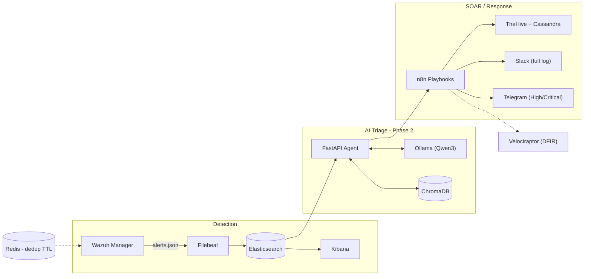

—# aigis-detect

SOC Lab Portfolio — local homelab with SIEM (Elastic Stack + Wazuh Manager),
SOAR (n8n + TheHive), DFIR (Velociraptor), and an AI triage agent
(Ollama + ChromaDB + FastAPI). Phase 1 and Phase 2 verified end-to-end;
Phase 3 targets an AWS deployment.

## Phase 1 architecture



*Diagram reflects Phase 1 (SIEM/SOAR/DFIR) and Phase 2 (AI triage agent), both verified end-to-end. Phase 3 (AWS honeypot deployment) is in progress and not yet in this diagram.*

## Metrics (measured)

| Metric | Value | Source |
|---|---|---|
| MITRE ATT&CK technique coverage | 7 / 8 techniques mapped to a real Wazuh rule ID | `data/mitre_techniques.json` |
| AI triage latency (default model, `qwen3:1.7b`) | ~2 min / triage | measured on CPU, no GPU |
| AI triage latency (full `qwen3`, deeper reasoning) | 5-10 min / triage (~1.7-2 tok/sec) | measured on CPU, no GPU |

These are current, self-measured numbers from running the stack locally — not a formal benchmark suite yet. See `CLAUDE.md` for the planned `run_evaluation.py` harness (next step, tracked in Roadmap below).

- **Elasticsearch + Kibana**: single storage and visualization layer.
- **Wazuh Manager** without its native indexer (OpenSearch) — alerts are read
  from `alerts.json` and shipped to Elasticsearch via **Filebeat**.
- **TheHive + Cassandra**: case management, indexed on the same Elasticsearch.
- **n8n**: playbook orchestration (SOAR) and alerting (Slack full log,
  Telegram only for high severity — configured as credentials inside n8n).
- **Velociraptor**: DFIR / incident response.
- **Redis**: alert deduplication with a short TTL.

## First run

1. `cp .env.example .env` (PowerShell: `Copy-Item .env.example .env`) and fill in
   the secrets (`THEHIVE_SECRET`, `N8N_PASSWORD`, etc).
2. Generate the Velociraptor config (one time only, before the first `up` —
   uses the volume already defined in the compose file, works the same in bash and PowerShell):
   ```
   docker compose run --rm --entrypoint velociraptor velociraptor config generate -c /velociraptor/server.config.yaml
   ```
3. `docker compose up -d`
4. Check container status: `docker compose ps` (everything should be
   `running`/`healthy` within 1-3 min; Elasticsearch and Cassandra take longer to start).
5. Verify health:
   - Kibana: http://localhost:5601
   - TheHive: http://localhost:9000
   - n8n: http://localhost:5678
   - Velociraptor GUI: https://localhost:8889
6. Confirm Wazuh alerts are reaching Elasticsearch:
   `curl http://localhost:9200/wazuh-alerts-*/_search?size=1`
7. Logs if something doesn't come up: `docker compose logs -f <service>`
   (e.g. `docker compose logs -f wazuh-manager`).

## Requirements

Docker Compose v2, ~16 GB RAM / 4 vCPU recommended (ES + Cassandra + Wazuh +
TheHive running together). For laptops with less RAM, lower `ES_JAVA_OPTS`
and `MAX_HEAP_SIZE` in `docker-compose.yml`, or comment out TheHive/Cassandra
if case management isn't needed for that work session.

## Phase 2 — AI triage agent

New services in the same `docker-compose.yml`: `ollama`, `chroma`, `agent`
(FastAPI, built from the `Dockerfile` at the repo root). Code in `src/agent/`.

1. Start the new services (with Phase 1 already up, or standalone if you
   don't need the rest right now):
   ```
   docker compose up -d ollama chroma agent
   ```
2. Pull the model (one time only — `qwen3:1.7b` is the default configured in
   `.env`, small enough to run comfortably on CPU; see the performance note below):
   ```
   docker compose exec ollama ollama pull qwen3:1.7b
   ```
3. Load the knowledge base into ChromaDB (runs from the host, not in Docker):
   ```
   pip install chromadb --break-system-packages
   python scripts/seed_kb.py
   ```
4. Test the endpoint:
   ```
   curl -X POST http://localhost:8080/triage \
     -H "Content-Type: application/json" \
     -d '{"alert_id": "test-1", "rule_id": "100002", "rule_description": "PowerShell execution detected"}'
   ```
5. Simple health check: `curl http://localhost:8080/health`

**Status of `data/mitre_techniques.json`:** 7 of the 8 techniques already have
a real `wazuh_rule_id` (extracted from the Wazuh 4.7.5 ruleset). Exception:
T1041 (Exfiltration Over C2 Channel) has no applicable native rule for an
on-prem homelab — it needs a custom rule in `local_rules.xml`.

**Performance note:** the full `qwen3` model running on CPU takes 5-10 min per
triage (a "thinking" model, ~1.7-2 tok/sec). The default `qwen3:1.7b` trades
some triage depth (it doesn't always invoke tools) for ~2 min per triage —
good enough for demo/portfolio use; for real-time use, evaluate a smaller
model or run on GPU.

## SOAR workflow (n8n → TheHive/Slack/Telegram)

`n8n/workflows/wazuh-triage-to-thehive.json` wires everything above together:
new alert in Elastic → agent → alert created in TheHive with the verdict →
Slack (always) → Telegram (high/critical only). Import steps, Redis
credential, and required environment variables are in `n8n/README.md`.

## Next steps

See `CLAUDE.md` — running the eval harness (`run_evaluation.py`) against
`qwen3:1.7b`, a GitHub Actions workflow for evals, and Phase 3
(Terraform + AWS) are the next deliverables.
