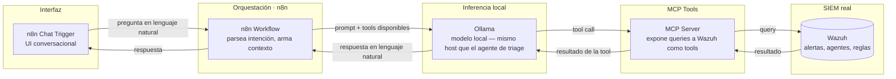

# Arquitectura — Asistente conversacional de investigación (Aigis-Detect)

Componente de investigación conversacional del pilar Aigis-Detect: un chat
donde un analista puede preguntarle en lenguaje natural sobre alertas,
IOCs o el estado del SIEM, y el asistente responde consultando Wazuh (y las
mismas fuentes de threat intel que ya usa el resto del pilar) en vivo, en
vez de que el analista arme la query a mano.

Convive con el resto del pilar SOC/Blue Team — SIEM/SOAR core, agente de
triage (`src/agent/`) y el workflow de bloqueo automático de IPs — sin
duplicar la conexión a Wazuh ni el enrichment de threat intel, que siguen
centralizados en `agent-orchestrator-soc/tools.py` y en el `agent` de este
mismo repo.

**Estado: propuesta de arquitectura, sin implementar.** Este documento fija
el diseño acordado el 2026-08-17 al fusionar el proyecto
`ai-soc-analyst-assistant` (que nunca llegó a existir como carpeta propia)
dentro de `aigis-detect`.

## Flujo de datos

## Componentes

| Pieza | Rol | Notas |
|---|---|---|
| n8n Chat Trigger | UI conversacional | Reutiliza la instancia n8n que ya corre el SOAR del pilar |
| n8n Workflow | Orquesta la conversación, arma el contexto para el modelo | Nuevo workflow, separado de `wazuh-triage-to-thehive.json` |
| Ollama (local) | Inferencia — mismo runtime que `src/agent/` | A definir si comparte modelo (`qwen3:1.7b`) o usa uno propio |
| MCP Tools | Expone consultas a Wazuh (alertas, agentes, reglas) como tools invocables | No reimplementa el enrichment de threat intel — eso vive en `agent-orchestrator-soc/tools.py` |
| Wazuh | SIEM real, fuente de datos | Mismo Wazuh Manager que ya alimenta el pipeline de triage |

## Por qué es un componente, no un proyecto separado

Decisión tomada el 2026-08-17: `ai-soc-analyst-assistant` y `aigis-detect`
comparten Wazuh como SIEM real y la misma categoría SOC/Blue Team, así que
dejan de tratarse como proyectos separados — mismo criterio ya aplicado al
descartar un repo aparte para el bloqueo automático de IPs (ver `CLAUDE.md`,
"Próximos pasos"). Mantenerlo como componente evita fragmentar el pilar y
evita duplicar tanto la conexión a Wazuh como el enrichment de threat intel
que el resto del pilar ya resuelve.

## Pendiente

- Diseñar el n8n Workflow del chat (nodo Chat Trigger + lógica de contexto).
- Definir el MCP server: qué queries a Wazuh expone como tools y con qué
  permisos (solo lectura).
- Decidir si comparte modelo Ollama con `src/agent/` o corre uno propio.
- Nada de esto está implementado todavía — este documento es el diseño de
  partida, no un componente funcionando.
