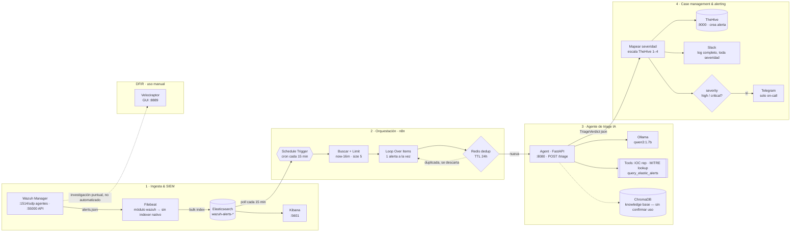

# Arquitectura del pipeline — Aigis-Detect

De la alerta cruda que genera Wazuh a la notificación en Slack o Telegram,
pasando por un agente de IA con tool-calling que decide el veredicto — así
fluyen los datos hoy, servicio por servicio.

- **Fase 1** (homelab SOC) — completa.
- **Fase 2** (agente de triage) — verificado end-to-end.
- **Pipeline** TheHive + Slack + Telegram — confirmado 2026-08-01.

Versión visual (mismo diagrama, con tabla de servicios y estilo dark/light):
https://claude.ai/code/artifact/33dd78eb-08f1-4e55-b462-10e307aeaa79

## Flujo de datos

## Servicios (docker-compose.yml)

| Servicio | Rol en el pipeline | Puerto host | |
|---|---|---|---|
| `wazuh-manager` | Recibe eventos de agentes y genera alertas (`alerts.json`) | 1514/udp · 1515 · 55000 | core |
| `filebeat` | Envía `alerts.json` del manager a Elasticsearch (módulo wazuh) | — | core |
| `elasticsearch` | Storage único — índice `wazuh-alerts-*` | 9200 | core |
| `kibana` | Visualización de alertas | 5601 | core |
| `n8n` | SOAR — cron 15 min, dedup, triage → TheHive/Slack/Telegram | 5678 | core |
| `redis` | Deduplicación de alertas (TTL 24h) | — | core |
| `agent` | FastAPI — triage con tool-calling nativo de Ollama | 8080 | core |
| `ollama` | Inferencia local — `qwen3:1.7b` | 11435 → 11434 | core |
| `chroma` | Knowledge base del agente (uso aún sin confirmar) | 8010 → 8000 | core |
| `thehive` + `cassandra` | Case management — recibe alertas triageadas | 9000 | core |
| `velociraptor` | DFIR — investigación manual, fuera del flujo automatizado | 8000 · 8889 · 8001 | manual |

---
*Generado a partir de `docker-compose.yml` + `n8n/workflows/wazuh-triage-to-thehive.json`.*
